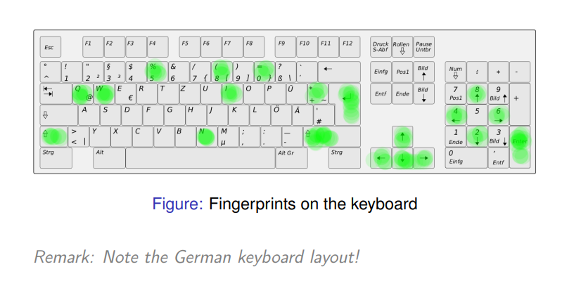
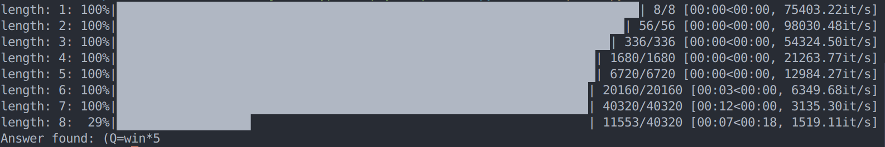

# expi3

## 题目

```
3.http://www.cryptopals.com/sets/1
(1) Convert hex to base64
(2) Fixed XOR
(3) Single-byte XOR cipher
(4) Detect single-character XOR
(5) Implement repeating-key XOR
(6) Break repeating-key XOR
```

## 实现

### Ques 1-5

```python
from typing import Literal
import base64

print('### Challenge 1 Convert hex to base64')

m = bytes.fromhex('49276d206b696c6c696e6720796f757220627261696e206c696b65206120706f69736f6e6f7573206d757368726f6f6d')
print(base64.b64encode(m).decode())

print()
print('### Challenge 2 Fixed XOR')

m1 = bytes.fromhex('1c0111001f010100061a024b53535009181c')
m2 = bytes.fromhex('686974207468652062756c6c277320657965')
res = bytes([x ^ y for x, y in zip(m1, m2)])
print(''.join(['%02x' % i for i in res]))

print()
print('### Challenge 3 Single-byte XOR cipher')

letter_frequency = {
    b'a': .08167, b'b': .01492, b'c': .02782, b'd': .04253,
    b'e': .12702, b'f': .02228, b'g': .02015, b'h': .06094,
    b'i': .06094, b'j': .00153, b'k': .00772, b'l': .04025,
    b'm': .02406, b'n': .06749, b'o': .07507, b'p': .01929,
    b'q': .00095, b'r': .05987, b's': .06327, b't': .09056,
    b'u': .02758, b'v': .00978, b'w': .02360, b'x': .00150,
    b'y': .01974, b'z': .00074, b' ': .15000
}

# use letter frequency
def single_byte_xor_crack(block):
    scores = []
    for ch in range(0, 0x100):
        res = [ch ^ i for i in block]
        scores.append({
            'key': ch,
            'message': res,
            'score' : sum([letter_frequency.get(bytes([i]), 0) for i in res])
        })
    return sorted(scores, key=lambda d: d['score'], reverse=True)[0]

c = bytes.fromhex('1b37373331363f78151b7f2b783431333d78397828372d363c78373e783a393b3736')
score = single_byte_xor_crack(c)
print('key (hex): %s, message: %s' % ('%02x' % score['key'], bytes(score['message']).decode()))


print()
print('### Challenge 4 Detect single-character XOR')

with open('./4.txt', 'r') as f:
    lines = f.readlines()
    lines = [bytes.fromhex(line) for line in lines]


scores = []

for i in range(len(lines)):
    scores.append({
        'line_idx': i,
        'best_score': single_byte_xor_crack(lines[i])
    })

best_score = sorted(scores, key=lambda x: x['best_score']['score'], reverse=True)[0]
print('line %d, key (hex): %s' % (best_score['line_idx'], ''.join('%02x' % (best_score['best_score']['key']))))
print(bytes(best_score['best_score']['message']).decode())


print('### Challenge 5 Implement repeating-key XOR')

def div_blocks(c: bytes, l: int, method: Literal['len', 'pos'] = 'len'):
    # padding with 0
    nblocks = (len(c) + (l - 1)) // l
    c = c.ljust(nblocks * l, b'\x00')
    blocks = []

    if method == 'len':
        for i in range(nblocks):
            blocks.append(c[i * l : (i + 1) * l])
    elif method == 'pos':
        for pos in range(l):
            blocks.append(bytes([c[i * l + pos] for i in range(nblocks)]))
        nblocks = l
    else: return None
    
    return blocks, nblocks

m = b'Burning \'em, if you ain\'t quick and nimble\nI go crazy when I hear a cymbal'

key = b'ICE'

blocks, _ = div_blocks(m, len(key))
c = b''

for block in blocks:
    c += bytes([x ^ y for x, y in zip(key, block)])

c = c[:len(m)]
print(''.join(['%02x' % ch for ch in c]))
```

### Ques 6

> 1. Let KEYSIZE be the guessed length of the key; try values from 2 to (say) 40.
>
> 2. Write a function to compute the edit distance/Hamming distance between two strings. The Hamming distance is just the number of differing bits. The distance between:
>
>    ```
>    this is a test
>    ```
>
>    and
>
>    ```
>    wokka wokka!!!
>    ```
>
>    is 37. _Make sure your code agrees before you proceed._
>
> 3. For each KEYSIZE, take the *first* KEYSIZE worth of bytes, and the *second* KEYSIZE worth of bytes, and find the edit distance between them. Normalize this result by dividing by KEYSIZE.
>
> 4. The KEYSIZE with the smallest normalized edit distance is probably the key. You could proceed perhaps with the smallest 2-3 KEYSIZE values. Or take 4 KEYSIZE blocks instead of 2 and average the distances.
>
> 5. Now that you probably know the KEYSIZE: break the ciphertext into blocks of KEYSIZE length.
>
> 6. Now transpose the blocks: make a block that is the first byte of every block, and a block that is the second byte of every block, and so on.
>
> 7. Solve each block as if it was single-character XOR. You already have code to do this.
>
> 8. For each block, the single-byte XOR key that produces the best looking histogram is the repeating-key XOR key byte for that block. Put them together and you have the key.

```python
import base64
from typing import Literal

white_list = []
white_list += [ord(i) for i in ',!.;?-\'\":/\n ']
white_list += list(range(ord('a'), ord('z') + 1)) + list(range(ord('A'), ord('Z') + 1))
white_list += list(range(ord('0'), ord('9') + 1))

letter_frequency = {
    b'a': .08167, b'b': .01492, b'c': .02782, b'd': .04253,
    b'e': .12702, b'f': .02228, b'g': .02015, b'h': .06094,
    b'i': .06094, b'j': .00153, b'k': .00772, b'l': .04025,
    b'm': .02406, b'n': .06749, b'o': .07507, b'p': .01929,
    b'q': .00095, b'r': .05987, b's': .06327, b't': .09056,
    b'u': .02758, b'v': .00978, b'w': .02360, b'x': .00150,
    b'y': .01974, b'z': .00074, b' ': .15000
}

def xor_str(a: bytes, b: bytes) -> bytes:
    if len(a) < len(b):
        return bytes([i ^ j for i, j in zip(a, b[:len(a)])])
    else: 
        return bytes([i ^ j for i, j in zip(a[:len(b)], b)])


def div_blocks(c: bytes, l: int, method: Literal['len', 'pos'] = 'len'):
    # padding with 0
    nblocks = (len(c) + (l - 1)) // l
    c = c.ljust(nblocks * l, b'\x00')
    blocks = []

    if method == 'len':
        for i in range(nblocks):
            blocks.append(c[i * l : (i + 1) * l])
    elif method == 'pos':
        for pos in range(l):
            blocks.append(bytes([c[i * l + pos] for i in range(nblocks)]))
        nblocks = l
    else: return None
    
    return blocks, nblocks

def distance(x: bytes, y: bytes):
    dst = 0
    xor_res = xor_str(x, y)
    for ch in xor_res:
        while ch != 0:
            dst += 1
            ch = ch & (ch - 1)
    return dst

def crack_key_length(c: bytes, nums: int = 4, lo: int = 2, hi: int = 40):
    dsts = []
    for l in range(lo, hi + 1):
        dst = []
        blocks, nblocks = div_blocks(c, l)
        for i in range(nblocks - 1):
            dst.append(distance(blocks[i], blocks[i + 1]) / l)
        dsts.append({'len': l, 'dst': sum(dst) / len(dst)})
    return sorted(dsts, key=lambda d: d['dst'])[:nums]


# # usr white list 
# def single_byte_xor_crack(blocks, pos):
#     for ch in range(0, 0x100):
#         valid = True
#         for c in blocks[pos]:
#             if c != 0 and c ^ ch not in white_list:
#                 valid = False
#                 break
#         if valid:
#             return ch
#     return None

# use letter frequency
def single_byte_xor_crack(blocks, pos):
    scores = []
    for ch in range(0, 0x100):
        res = [ch ^ i for i in blocks[pos]]
        scores.append({
            'key': ch,
            'score' : sum([letter_frequency.get(bytes([i]), 0) for i in res])
        })
    return sorted(scores, key=lambda d: d['score'], reverse=True)[0]['key']
    

def crack_with_length(c: bytes, l: int):
    key = b''
    # group by pos
    blocks, nblocks = div_blocks(c, l, method='pos')
    for pos in range(l):
        ch = single_byte_xor_crack(blocks, pos)
        if ch is None:
            return None
        key += bytes([ch])
    return key

def crack(c: bytes):
    dsts = crack_key_length(c)
    for d in dsts:
        l = d['len']
        key = crack_with_length(c, l)
        if key is not None:
            return key
    return None
        

if __name__ == '__main__':
    with open('./6.txt', 'rb') as f:
        c = f.read()
    c = base64.b64decode(c)
    key = crack(c)
    if key is not None:
        print(f'length {len(key)}, key found: {key}')
        print('\nmessage: ')
        m = b''
        blocks, nblocks = div_blocks(c, len(key))
        for i in range(nblocks):
            m += bytes([i ^ j for i, j in zip(blocks[i], key)])
        m = m[:len(c)]
        print(m.decode())
```

结果

```
length 29, key found: b'Terminator X: Bring the noise'

message: 
I'm back and I'm ringin' the bell 
A rockin' on the mike while the fly girls yell 
In ecstasy in the back of me 
Well that's my DJ Deshay cuttin' all them Z's 
Hittin' hard and the girlies goin' crazy 
Vanilla's on the mike, man I'm not lazy. 

I'm lettin' my drug kick in 
It controls my mouth and I begin 
To just let it flow, let my concepts go 
My posse's to the side yellin', Go Vanilla Go! 

Smooth 'cause that's the way I will be 
And if you don't give a damn, then 
Why you starin' at me 
So get off 'cause I control the stage 
There's no dissin' allowed 
I'm in my own phase 
The girlies sa y they love me and that is ok 
And I can dance better than any kid n' play 

Stage 2 -- Yea the one ya' wanna listen to 
It's off my head so let the beat play through 
So I can funk it up and make it sound good 
1-2-3 Yo -- Knock on some wood 
For good luck, I like my rhymes atrocious 
Supercalafragilisticexpialidocious 
I'm an effect and that you can bet 
I can take a fly girl and make her wet. 

I'm like Samson -- Samson to Delilah 
There's no denyin', You can try to hang 
But you'll keep tryin' to get my style 
Over and over, practice makes perfect 
But not if you're a loafer. 

You'll get nowhere, no place, no time, no girls 
Soon -- Oh my God, homebody, you probably eat 
Spaghetti with a spoon! Come on and say it! 

VIP. Vanilla Ice yep, yep, I'm comin' hard like a rhino 
Intoxicating so you stagger like a wino 
So punks stop trying and girl stop cryin' 
Vanilla Ice is sellin' and you people are buyin' 
'Cause why the freaks are jockin' like Crazy Glue 
Movin' and groovin' trying to sing along 
All through the ghetto groovin' this here song 
Now you're amazed by the VIP posse. 

Steppin' so hard like a German Nazi 
Startled by the bases hittin' ground 
There's no trippin' on mine, I'm just gettin' down 
Sparkamatic, I'm hangin' tight like a fanatic 
You trapped me once and I thought that 
You might have it 
So step down and lend me your ear 
'89 in my time! You, '90 is my year. 

You're weakenin' fast, YO! and I can tell it 
Your body's gettin' hot, so, so I can smell it 
So don't be mad and don't be sad 
'Cause the lyrics belong to ICE, You can call me Dad 
You're pitchin' a fit, so step back and endure 
Let the witch doctor, Ice, do the dance to cure 
So come up close and don't be square 
You wanna battle me -- Anytime, anywhere 

You thought that I was weak, Boy, you're dead wrong 
So come on, everybody and sing this song 

Say -- Play that funky music Say, go white boy, go white boy go 
play that funky music Go white boy, go white boy, go 
Lay down and boogie and play that funky music till you die. 

Play that funky music Come on, Come on, let me hear 
Play that funky music white boy you say it, say it 
Play that funky music A little louder now 
Play that funky music, white boy Come on, Come on, Come on 
Play that funky music
```


# expi4

## 题目

```
4.MTC3 Cracking SHA1-Hashed Passwords
https://www.mysterytwisterc3.org/en/challenges/level-2/cracking-sha1-hashed-passwords
```

hash of password is `67ae1a64661ac8b4494666f58c4822408dd0a3e4`



## 实现

```python
import hashlib
import itertools
from math import *
from tqdm import tqdm

target_hash = "67ae1a64661ac8b4494666f58c4822408dd0a3e4"

possible_char = ['0', '5', '8', 'Q', 'W', 'I', 'N', '+']

table = {'Q': 'q', 'W': 'w', 'I': 'i', 'N': 'n', '5': '%', '8': '(', '0': '=', '+': '*'}

def sha1_crack(target_hash, possible_char):
    for length in range(1, 10):
        pbar = tqdm(itertools.permutations(possible_char, length), 
                    total=factorial(len(possible_char)) // factorial(len(possible_char) - length),
                    desc=f'length: {length}')
        for permutation in pbar:
            password = ''.join(permutation)

            for mask in itertools.product([True, False], repeat=length):
                password_tmp = list(password)
                for i in range(len(mask)):
                    if mask[i]:
                        password_tmp[i] = table[password_tmp[i]]

                password_tmp = ''.join(password_tmp)
                # print(password_tmp)
                # pbar.set_description(f'length {length}, trying {password_tmp}')
            
                hash_object = hashlib.sha1(password_tmp.encode())
                hash_hex = hash_object.hexdigest()
                
                if hash_hex == target_hash:
                    return password_tmp
    
    return None


password = sha1_crack(target_hash, possible_char)

if password:
    print(f"Answer found: {password}")
else:
    print("No answer found")

```



ans: `(Q=win*5`

